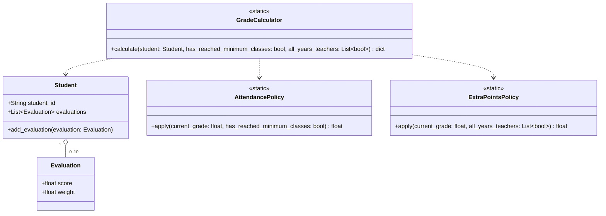

# CS-GradeCalculator Diagrama de Clases UML

Este diagrama muestra las relaciones entre las clases principales en el sistema CS-GradeCalculator.

### Relaciones Explicadas:

*   **`Student` o-- `Evaluation`**: Un objeto `Student` puede contener entre 0 y 10 objetos `Evaluation` (Composición).
*   **`GradeCalculator` ..> `Student`**: La clase `GradeCalculator` depende de la clase `Student` para acceder a las evaluaciones del estudiante.
*   **`GradeCalculator` ..> `AttendancePolicy`**: La `GradeCalculator` utiliza la `AttendancePolicy` para aplicar las reglas de asistencia.
*   **`GradeCalculator` ..> `ExtraPointsPolicy`**: La `GradeCalculator` utiliza la `ExtraPointsPolicy` para aplicar las reglas de puntos adicionales.